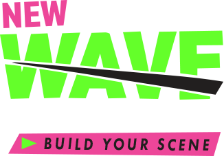
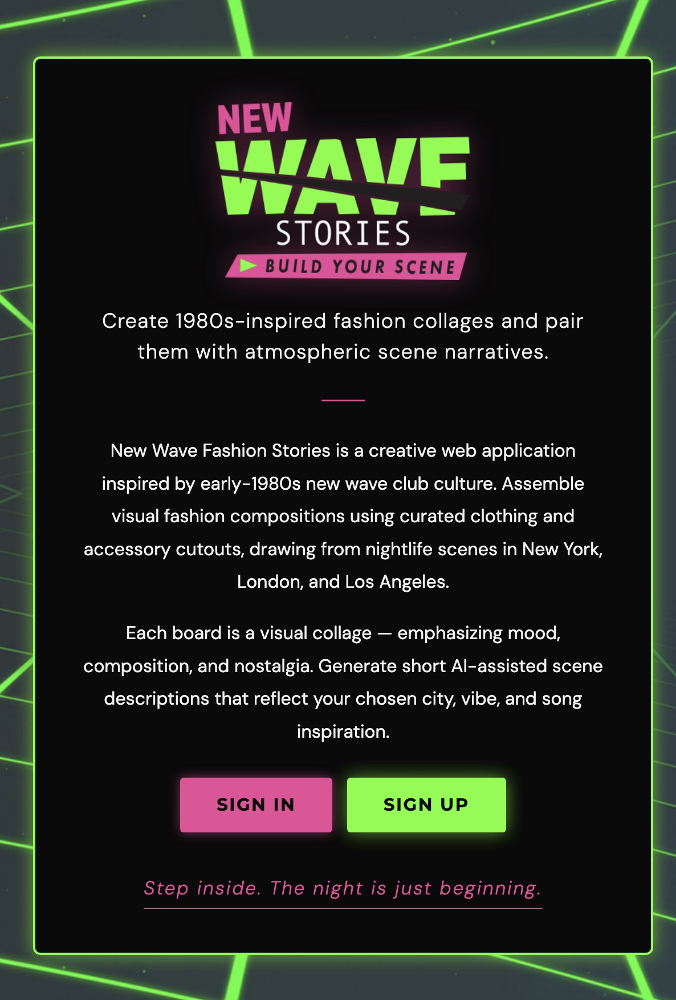
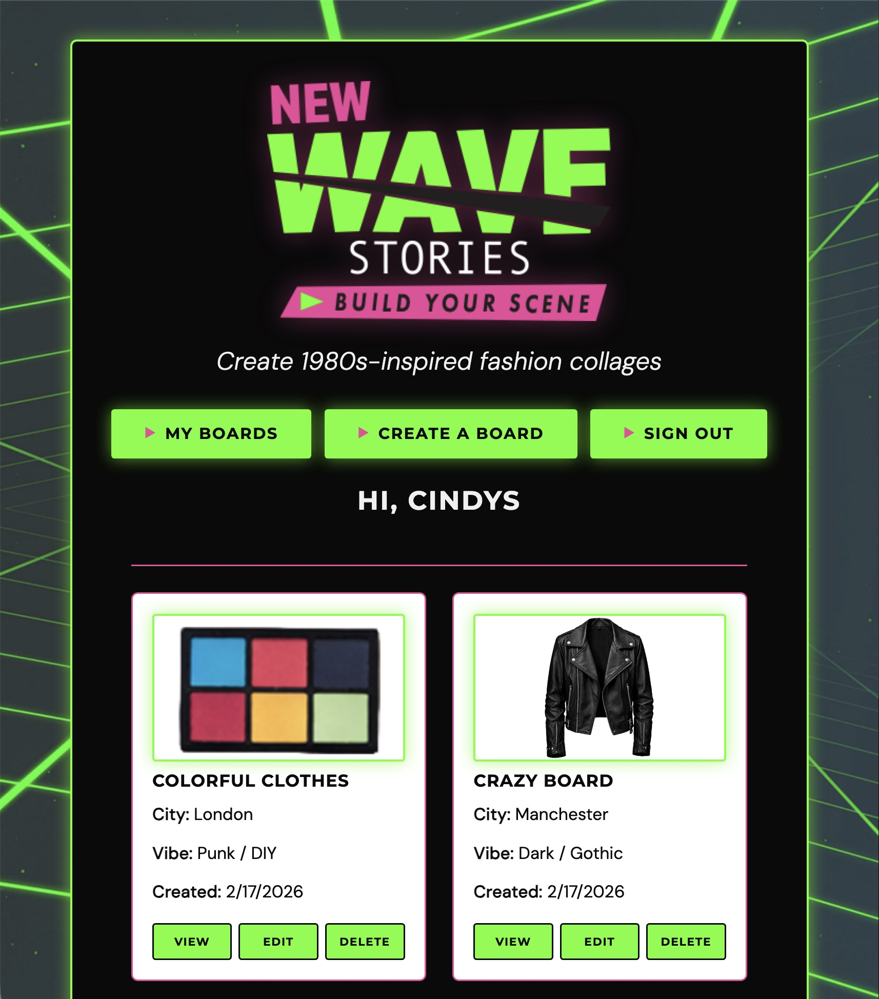
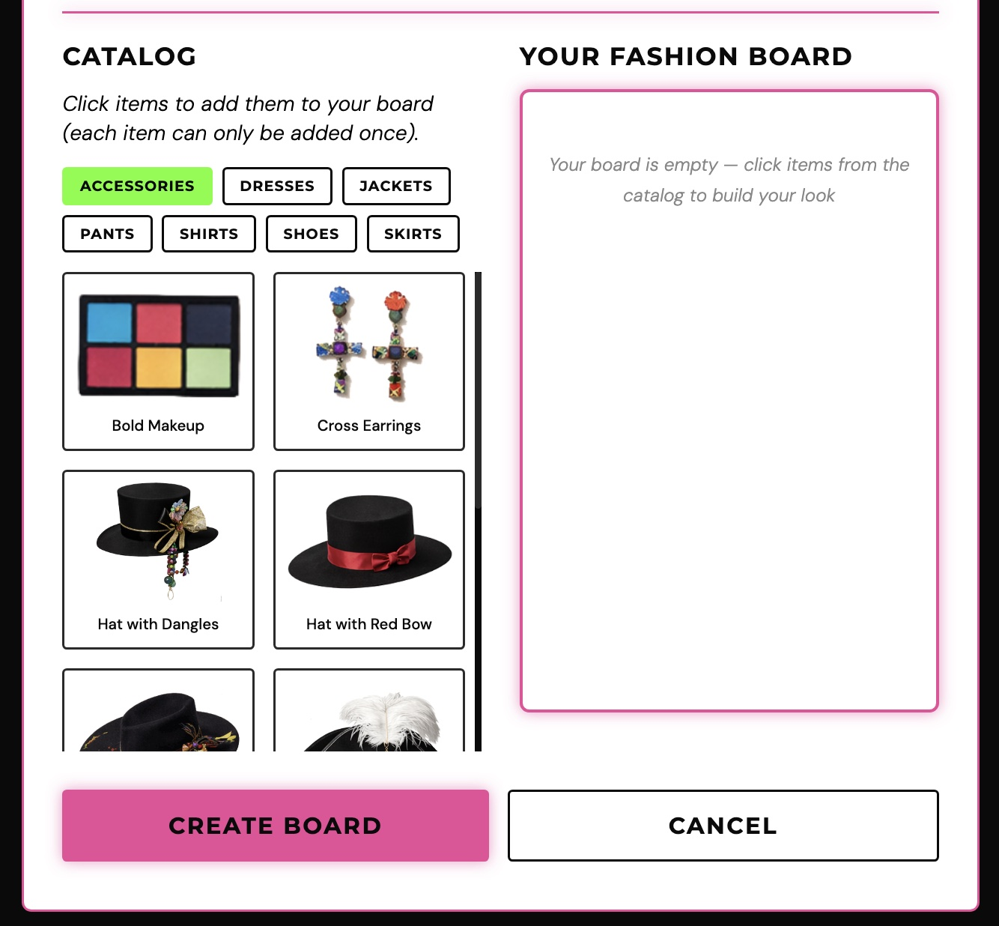

  

### [🚀 CLICK TO DEMO](https://new-wave-stories.netlify.app/)

## 📝 Description

**New Wave Stories** is a full-stack web application inspired by Polyvore and early-1980s new wave club culture. Users assemble visual fashion collages using curated clothing and accessory cutouts, drawing from nightlife scenes in cities like New York, London, and Los Angeles. Each board functions as a creative composition emphasizing mood, aesthetics, and nostalgia. Users can also generate short AI-powered scene narratives that reflect their chosen city, vibe, and song inspiration.

## 💡 Why I Built It

I have never been able to let go of the 1980s — the music, the fashion, the energy of that era has always stayed with me. I wanted to build something that combined that passion with the kind of creative, playful experience I used to love on Polyvore. New Wave Stories is my love letter to that decade, reimagined as a full-stack application where fashion and atmosphere come together.

---

## 🚀 Getting Started

  
Deployed App

  <a href="https://new-wave-stories.netlify.app/">https://new-wave-stories.netlify.app/</a>

  
Project Planning (Trello)

  <a href="https://trello.com/b/uIspwpbX/new-wave-fashion-stories">https://trello.com/b/uIspwpbX/new-wave-fashion-stories</a>

  
Back-End Repository

  <a href="https://github.com/veggiebyte/new-wave-stories-backend">https://github.com/veggiebyte/new-wave-stories-backend</a>

---

## 📸 Screenshots

| Landing Page |
|:---:|
|  |

| Create a Board |
|:---:|
|  |

| Catalog |
|:---:|
|  |

---

## 🖥️ Technologies Used

---

## 🙏 Attributions

- [Google Fonts](https://fonts.google.com/) — Montserrat and DM Sans typefaces
- [Anthropic API](https://www.anthropic.com/) — AI-powered scene story generation
- [Adobe Firefly](https://firefly.adobe.com/) — AI-generated clothing and accessory images
- [Adobe Illustrator](https://www.adobe.com/products/illustrator.html) — Logo design
- [Adobe Photoshop](https://www.adobe.com/products/photoshop.html) — Background removal and image sizing for catalog assets
- [Depositphotos](https://depositphotos.com/) — Additional clothing and graphic assets
- Various internet sources — Band photography used for song inspiration visuals

---

## 🛰️ Next Steps

- Allow users to freely drag and position items anywhere on a canvas for true collage-style composition
- Add preset background options to give boards stronger visual context
- Allow users to resize and layer items for more detailed visual compositions
- Add short text labels and captions to annotate looks and settings
- Allow users to mark boards as public to share with other users
- Enable visitors to browse public boards without logging in
- Add commenting on public boards for community interaction
